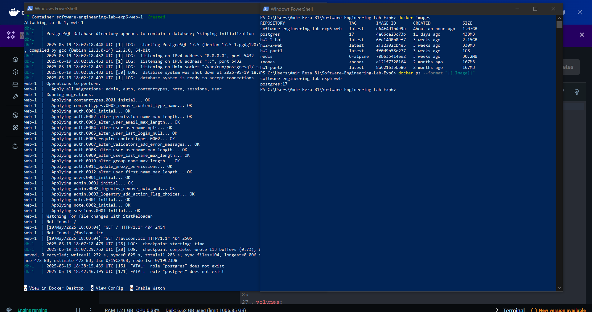
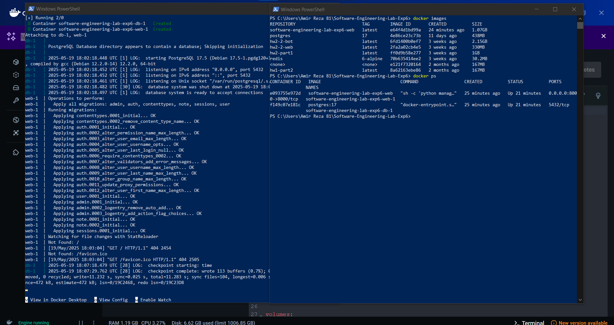
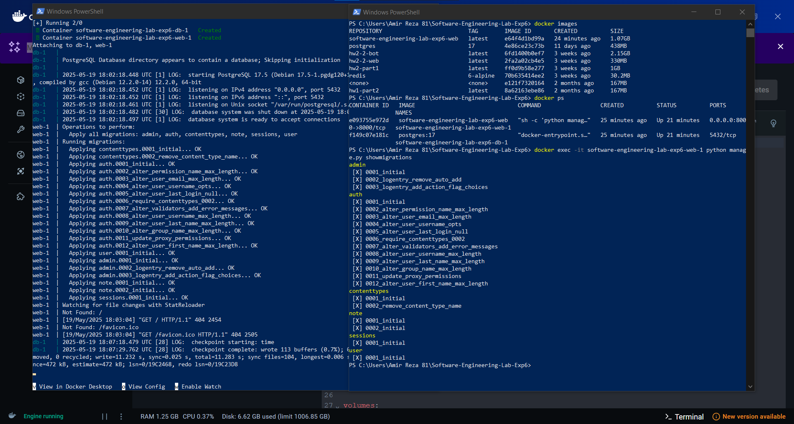
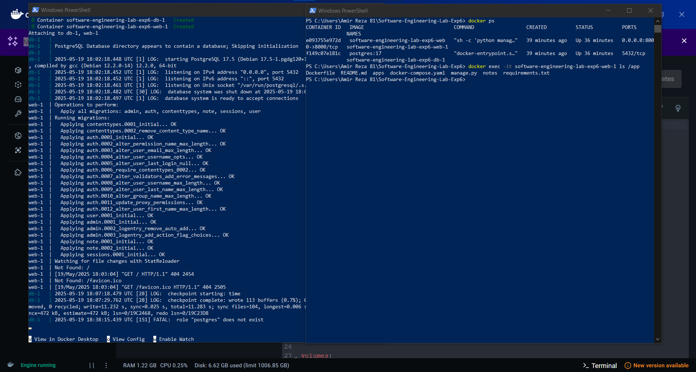
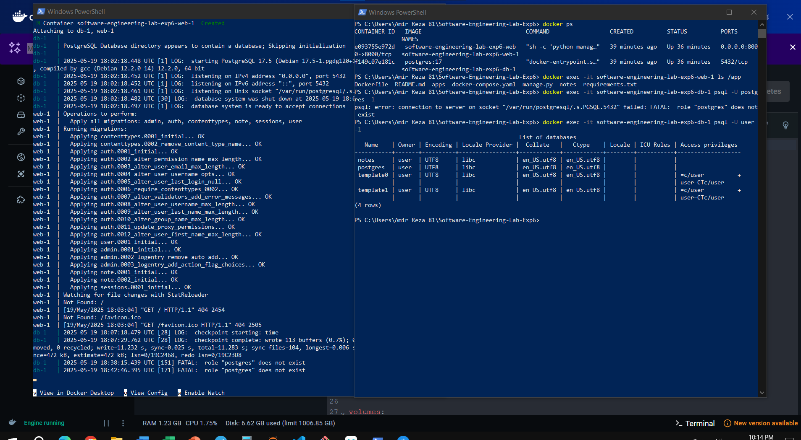

# آزمایش ششم - استقرار یک نرم‌افزار به کمک Docker

## راه‌اندازی پروژه با داکر

در این پروژه از داکر برای اجرای برنامه استفاده شده است. دو فایل اصلی برای راه‌اندازی پروژه وجود دارد:

---

## فایل `Dockerfile`

```Dockerfile
FROM python:3.11
WORKDIR /app
COPY . .
RUN pip install -r requirements.txt
CMD ["sh", "-c", "python manage.py migrate && python manage.py runserver 0.0.0.0:8000"]
```

این فایل شامل مراحل زیر است:
- استفاده از تصویر پایه‌ی پایتون نسخه ۳.۱۱
- تعیین دایرکتوری کاری به عنوان `/app`
- کپی کردن تمام فایل‌ها به درون کانتینر
- نصب وابستگی‌ها با استفاده از `requirements.txt`
- اجرای دستورات `migrate` و سپس راه‌اندازی سرور جنگو روی پورت ۸۰۰۰

---

## فایل `docker-compose.yaml`

```yaml
version: '3.9'

services:
  db:
    image: postgres:17
    restart: unless-stopped
    environment:
      - POSTGRES_DB=notes
      - POSTGRES_USER=user
      - POSTGRES_PASSWORD=password
    volumes:
      - postgres_data:/var/lib/postgresql/data

  web:
    build: .
    ports:
      - 8000:8000
    depends_on:
      - db
    environment:
      - DB_HOST=db
      - DB_PORT=5432
      - DB_NAME=notes
      - DB_USER=user
      - DB_PASSWORD=password

volumes:
  postgres_data:
```

در این فایل دو سرویس تعریف شده است:

### سرویس `db`:
- استفاده از تصویر `PostgreSQL` نسخه ۱۷
- تعیین متغیرهای محیطی برای ساخت پایگاه داده
- ذخیره اطلاعات پایگاه داده در یک volume به نام `postgres_data`

### سرویس `web`:
- ساخت از روی `Dockerfile` فعلی
- اتصال پورت ۸۰۰۰ کانتینر به پورت ۸۰۰۰ سیستم
- وابستگی به سرویس `db` برای اتصال به پایگاه داده
- تعیین متغیرهای محیطی مربوط به پایگاه داده

---

## اجرای وب سرور

برای اجرای پروژه از دستور زیر استفاده می‌کنیم:

```bash
docker-compose up -d
```

---

## روند اجرا

### ابتدا، داکر شروع به دانلود تصاویر می‌کند:


---

### سپس، پس از اتمام دانلود، کانتینرها با موفقیت ساخته و اجرا می‌شوند:


سپس با اجرای و مشاهده کانتینر web می توان به آن درسترسی داشت و فایل پروژه را به عنوان یک وب سرور استفاده کرد که نشانه درست ران شدن داکر است:


## ارسال درخواست با Postman
اپلیکیشن postman را اجرا کرده و سپس در گام اول به شکل زیر یک درخواست POST می‌زنیم و یک کاربر با یوزرنیم user1 و پسورد 1234 می‌سازیم.


حال با یک درخواست POST دیگر لاگین را انجام می‌دهیم.


مشاهده می‌کنیم که کد 200 یعنی موفقیت آمیز بودن لاگین برگردانده شد، همچنین کوکی‌ها نیز تنظیم شدند.


حال به وسیله یک ریکوئست POST، یک note با تایتل title1 و بدنه body1 می‌سازیم.


حال به همین شکل یک note با تایتل title2 و بدنه body2 می‌سازیم.


در نهایت نیز لیست note های کاربر را با استفاده از یک ریکوئست GET می‌گیریم و می‌بینیم که دو تا note ای که ساختیم نمایش داده می‌شود.


## تعامل با داکر

در این بخش، در قسمت اول با دستورهای مناسب، imageها و containerهای خود را نشان می‌دهیم.

دستور `docker images`:


در تصویر بالا لیست imageها را مشاهده می‌کنید.
software-engineering-lab-exp6-web و postgres:17 از image های مورد استفاده ما می‌باشند.

دستور `docker ps`:


با اجرای دستور `docker ps` لیست کانتینرهای در حال اجرا نمایش داده شد. طبق خروجی، دو کانتینر فعال هستند: یکی با تصویر `software-engineering-lab-exp6-web` که وب‌سرور پروژه را اجرا می‌کند و روی پورت ۸۰۰۰ سیستم میزبان در دسترس است، و دیگری با تصویر `postgres:17` که مربوط به پایگاه داده PostgreSQL است و روی پورت ۵۴۳۲ فعال است. این اطلاعات نشان می‌دهد هر دو بخش اصلی پروژه (وب‌سرور و پایگاه داده) به‌درستی اجرا شده‌اند.



با اجرای دستور `docker exec -it software-engineering-lab-exp6-web-1 python manage.py showmigrations`، لیست مهاجرت‌های اعمال‌شده در پروژه جنگو نمایش داده شد. این خروجی نشان می‌دهد که تمامی مهاجرت‌ها (migrations) مربوط به اپلیکیشن‌های مختلف از جمله admin، auth، contenttypes، note، sessions و user با موفقیت انجام شده‌اند (با علامت [X] مشخص شده‌اند) که بیانگر آماده بودن ساختار پایگاه داده برای استفاده توسط وب‌اپلیکیشن است.



با اجرای دستور `docker exec -it software-engineering-lab-exp6-web-1 ls /app`، محتوای دایرکتوری /app در کانتینر وب‌سرور نمایش داده شد. این خروجی نشان می‌دهد که فایل‌های مهم پروژه از جمله Dockerfile، docker-compose.yaml، manage.py و requirements.txt به همراه پوشه‌های apps و notes در این مسیر قرار دارند که نمایانگر ساختار اصلی پروژه جنگو در کانتینر است.



با اجرای دستور `docker exec -it software-engineering-lab-exp6-db-1 psql -U user -l`، لیست دیتابیس‌های موجود در کانتینر پایگاه داده نمایش داده شد. خروجی شامل چهار دیتابیس notes، postgres، template0 و template1 است که همگی با مالکیت کاربر user و با کدگذاری UTF8 ایجاد شده‌اند. دیتابیس notes احتمالاً مربوط به اپلیکیشن اصلی پروژه است. این اطلاعات نشان می‌دهند که اتصال به پایگاه داده موفق بوده و دیتابیس‌ها به درستی راه‌اندازی شده‌اند.

---

## پرسش‌ها

### پرسش 1:
داکرفایل یک فایل متنی ساده است که مجموعه‌ای از دستورالعمل‌ها را برای ساخت یک محیط اجرایی مشخص تعریف می‌کند. این فایل تعیین می‌کند که از کدام سیستم‌عامل پایه استفاده شود، چه بسته‌هایی نصب شوند، چه فایل‌هایی کپی شوند، و در نهایت چه دستوری هنگام اجرای برنامه اجرا شود. در واقع، Dockerfile مانند دستورالعملی است که به داکر می‌گوید چگونه محیط مورد نظر ما را بسازد.

پس از نوشتن Dockerfile، داکر با استفاده از آن، یک Image می‌سازد. Image در واقع یک قالب یا snapshot آماده و غیرقابل‌تغییر از محیط نرم‌افزاری است که تمام نیازهای اجرای برنامه را در خود دارد. این محیط شامل سیستم‌عامل پایه، کتابخانه‌های مورد نیاز، کد برنامه، و هر چیز دیگری است که در Dockerfile مشخص شده است. Image‌ها قابل حمل هستند و می‌توان آن‌ها را در سیستم‌های مختلف بدون نگرانی از ناسازگاری اجرا کرد.

با استفاده از یک Image می‌توان یک یا چند Container ایجاد کرد. Container‌ یک نمونه live و اجرایی از Image است که برنامه ما در آن اجرا می‌شود. هر Container مانند یک محیط جداگانه و ایزوله عمل می‌کند که به طور مستقل از دیگر Containerها یا سیستم میزبان فعالیت می‌کند. چون که Containerها سبک‌وزن و سریع هستند، می‌توان به راحتی آن‌ها را متوقف، حذف یا دوباره اجرا کرد.


### پرسش 2:

کوبِرنِتِس یک پلتفرم متن‌باز برای مدیریت و خودکارسازی استقرار، مقیاس‌دهی و عملیات کانتینرها در محیط‌های چندسروری است که به توسعه‌دهندگان و مدیران سیستم اجازه می‌دهد تا برنامه‌های کانتینری شده را به شکلی پایدار، قابل اطمینان و بهینه اجرا کنند. این سیستم با فراهم کردن امکاناتی مانند تعادل بار، بازیابی خودکار، توزیع منابع و به‌روزرسانی‌های بدون وقفه، پیچیدگی مدیریت تعداد زیادی کانتینر را کاهش می‌دهد و باعث می‌شود که برنامه‌ها به صورت مستمر و بدون قطعی اجرا شوند.

 این ابزار بیشتر برای استقرار و مدیریت برنامه‌هایی که در قالب کانتینر اجرا می‌شوند به کار می‌رود و امکان مقیاس‌دهی خودکار، بازیابی خودکار از خرابی‌ها و مدیریت منابع به صورت کارآمد را فراهم می‌کند. رابطه کوبرنتس با داکر این است که داکر مسئول ساخت و اجرای کانتینرها است و کوبرنتس به عنوان یک سیستم ارکستریشن، وظیفه مدیریت، هماهنگی و استقرار این کانتینرها را در محیط‌های چندسروری بر عهده دارد. به عبارت دیگر، کوبرنتس کانتینرهایی را که داکر ساخته مدیریت می‌کند تا برنامه‌ها به صورت مقیاس‌پذیر و قابل اطمینان اجرا شوند.

 ---


### تقسیم کار
در این آزمایش تلاش شد تا تسک‌ها به طور یکسان بین اعضای تیم پخش شود. بخش اول اول  و استقرار پروژه را یک فرد انجام داد. بخش دوم و ارسال درخواست به وب‌سرور و پاسخ سوال اول را نفر دیگر و بخش تعامل با داکر و پرسش دوم را نفر سوم انجام داد.

[لینک کانبان‌برد](https://github.com/users/reza-heidari-ce/projects/2)

---

### اعضای تیم
- امیررضا آذری - 99101087
- رضا حیدری - 400109616
- امید دلیران - 400104931
